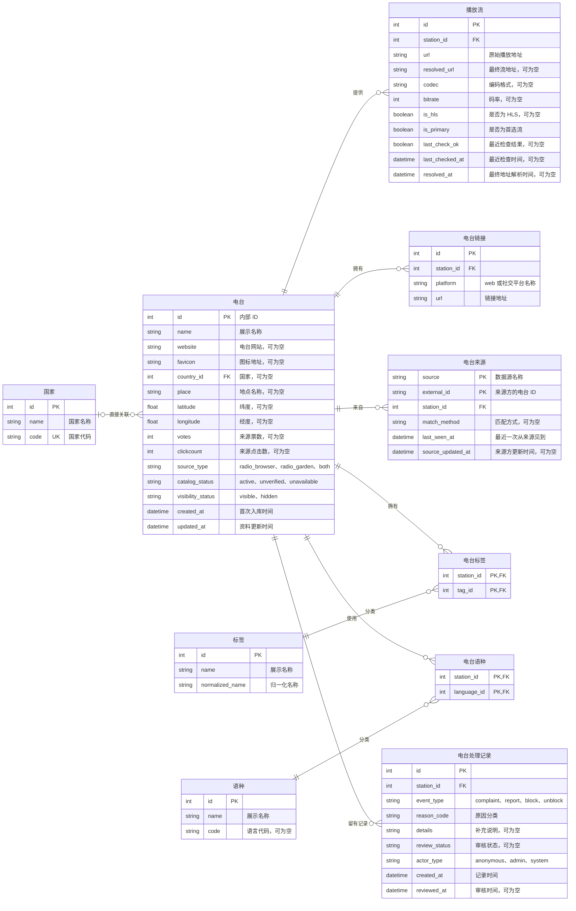

# V2 电台数据库设计（旧稿）

本文保留早期设计记录，以下整数 ID 等内容已过时。当前数据库字段、字符串 ID 规则和导入状态以 [`worldTuner-data/v2/docs/电台数据库设计.md`](../../worldTuner-data/v2/docs/电台数据库设计.md) 为准。

本文记录 V2 电台数据结构的当前设计。目标是将电台、播放流、外部链接、数据来源和分类关系分开保存，并为投诉、举报及平台屏蔽保留处理记录。建表定义位于 [`worldTuner-data/v2/schema.sql`](../../worldTuner-data/v2/schema.sql)；Radio Garden 已有本地导入脚本，API 尚未实现。

## 设计约定

- `station` 是唯一的电台主体；`id` 是 V2 新库的内部主键，可以重新分配，不维护旧电台 ID 映射。
- 电台最多关联一个国家，不维护国家以下的州、省等行政区划；地点名称和坐标直接保存在电台上。`place` 只用于地点文本搜索，不表示行政区划。
- 标签和语种均为多对多关系。原始逗号分隔文本不作为 V2 的关联依据。
- 播放地址单独保存；电台主表保留 `website` 字符串，其他网站及社交链接由关联表保存。一个电台可以有多个播放流、多个同平台链接。
- `station.source_type` 是便于查询的来源摘要；`station_source` 中的外部 ID 和来源关联是来源身份的依据。
- 没有用户体系。处理记录中的 `anonymous` 不对应用户表；`hidden` 表示平台对外屏蔽，而非个人拉黑。
- 下文的 `boolean` 和 `datetime` 是逻辑类型；若落地到 D1/SQLite，分别使用带约束的 `INTEGER` 和统一格式的 `TEXT`。

## ER 图

图的可编辑版本如下；目录中的 [ER 图图片](mermaid-diagram.png) 是讨论阶段保存的图片。

## 电台主体

| 字段 | 约束与含义 |
| --- | --- |
| `id` | 主键；仅作为 V2 内部标识，不承诺与旧库 ID 相同。 |
| `name` | 非空展示名称。来源缺少可信名称时，导入规则需确定占位名称和 `catalog_status`。 |
| `website` | 可空的网站 URL 字符串；Radio Garden 直接保存频道详情中的 `website`，不为同一值重复生成 `station_link`。 |
| `favicon` | 可空的图标 URL。 |
| `country_id` | 可空外键，直接指向 `country.id`。未知国家保留空值。 |
| `place` | 可空的地点名称字符串，用于地点关键词搜索；不表示行政区划或城市边界。Radio Garden 可取频道关联地点的 `title`，Radio Browser 可取非空 `state`。 |
| `latitude`、`longitude` | 可空坐标，必须同时存在或同时为空；范围分别为 -90～90、-180～180。 |
| `votes`、`clickcount` | 可空的来源统计值；现阶段迁移 Radio Browser 原值，Radio Garden 缺失时为 `NULL`，不跨来源相加。 |
| `source_type` | 非空，当前取 `radio_browser`、`radio_garden`、`both`；应由 `station_source` 的关联集合计算并同步维护。 |
| `catalog_status` | 非空，`active`、`unverified`、`unavailable`；描述电台资料或播放可用性。 |
| `visibility_status` | 非空，默认 `visible`，另有 `hidden`；仅描述平台是否展示该电台。 |
| `created_at`、`updated_at` | 非空，记录 V2 入库和资料更新时间；不冒充来源方的创建或更新时间。 |

`catalog_status` 与 `visibility_status` 相互独立：电台可有可用的播放流，但因处理决定而被屏蔽。`station` 不再包含原始的 `homepage`、`state` 或 `iso_3166_2` 字段；Radio Browser 的 `state` 仅作为 `place` 的候选文本。

## 播放流、链接与来源

### `station_stream`：播放地址及检查状态

`url` 保存原始播放入口，`resolved_url` 保存最终解析地址；`codec`、`bitrate`、`is_hls` 和检查结果均归属于具体播放流。来源未提供 HLS 信息时 `is_hls` 为 `NULL`，不能推断为否。每个电台可有零到多个播放流，但同一时刻最多一个 `is_primary = true` 的流。没有可用流时如何选定首选流，需在导入与播放规则中统一定义。

### `station_link`：其他网站及社交链接

`platform = 'web'` 表示电台主表 `website` 以外的网站链接；社交平台直接保存来源提供的平台名，不设置仅允许当前已知平台的白名单。同一电台允许多个 `web` 或相同社交平台的链接，以 `(station_id, platform, url)` 去重。

| 来源字段 | V2 字段 |
| --- | --- |
| Radio Browser `homepage` | `station_link(platform='web', url=homepage)` |
| Radio Garden `website` | `station.website`，保留字符串，不重复写入 `station_link` |
| Radio Garden `social[]` 中每一项 | `station_link(platform=social.platform, url=social.url)` |

### `station_source`：来源身份

以 `(source, external_id)` 为联合主键，一个来源记录只指向一个 V2 电台。Radio Browser 的 `stationuuid`、Radio Garden 的频道 ID 分别作为对应来源的 `external_id`，不互相伪装成同一种 ID。`match_method` 记录跨源匹配方法，`last_seen_at` 记录本地最近一次见到该来源记录的时间。来源方有可靠更新时间时才写 `source_updated_at`。

## 标签、语种与国家

- `station_tag` 和 `station_language` 分别以两个外键组成联合主键，避免同一电台重复关联同一分类。
- `tag.normalized_name` 用于归一化和去重；同义词是否合并到同一个标签，需要单独制定清洗规则，不仅靠大小写匹配。
- `language.code` 可空，避免把没有可靠标准代码的来源文本硬映射到错误语种。
- `country.code` 是唯一的国家代码；没有可靠代码的电台允许 `country_id = NULL`，不凭自由文本猜测关联。
- 分类电台数可由关联关系统计，暂不作为这四个核心实体的基础字段。

## 投诉、举报与屏蔽

`moderation_record` 保存 `complaint`、`report`、`block`、`unblock` 事件。投诉和举报可带 `review_status`，初始为 `pending`；处理后可记为 `accepted` 或 `rejected`。`block`、`unblock` 是平台操作，不要求有审核状态。`actor_type` 仅区分匿名提交、管理操作或系统操作，没有 `user_id`。

收到投诉或举报只新增记录，不自动屏蔽。决定屏蔽时新增 `block` 记录，并在同一事务中将 `station.visibility_status` 改为 `hidden`；恢复时新增 `unblock` 记录并改回 `visible`。记录保留处理历史，电台字段保存当前展示状态。

## 迁移边界与待定规则

1. 从现有 Radio Browser、Radio Garden 数据生成 V2 新库，先在本地验证，再单独规划 D1 导入；日常检查不修改生产库。
2. 可以重新分配 `station.id`，不创建旧 ID 映射表，也不以旧收藏或旧链接兼容为迁移约束。
3. 旧 `station.tags`、`station.language` 等自由文本需要拆分和清洗后进入关联表；不完整或有冲突的值保留在源数据中供核查，不强行建立错误关联。
4. Radio Browser 的非空 `state` 可以作为 `station.place` 的来源；`iso_3166_2` 不进入 V2 目标结构。Radio Garden 同一频道若关联多个地点，导入时需确定单值选择规则，不能直接丢失或拼接来源关系；国家仍直接关联电台。
5. 屏蔽电台在列表、搜索、地图和详情接口中的具体返回行为，以及 `catalog_status` 的更新触发条件，实施 API 前需统一确定。
6. 后续若开放匿名投诉或举报写入 API，需要单独设计输入校验、限流和滥用防护；当前 ER 图只定义存储结构。
