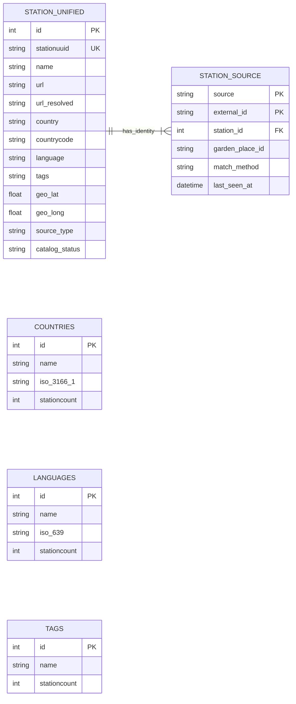

# WorldTuner 双数据源电台基础数据模型（v1 兼容评审稿）

> 当前只设计电台、播放地址、国家、语言、标签和经纬度。以 v1 `station` 表为基础，把 Radio Garden 数据合入一张新电台表；暂不实施迁移、导入或 API 切换。

## 1. 设计结论

**可以沿用 v1 的表形状。** 新建 `station_unified`，完整保留现有 `station` 的字段名和含义，新增少量来源与字段出处信息；复制 Radio Browser 记录时保留原数字 `id`，Radio Garden 独有频道分配新的数字 `id`。这样现有 Web、Android 和 Worker 的 DTO 仍容易兼容。

另建一张很小的 `station_source` 映射表，保存每个来源的原始 ID。**`station_unified` 是唯一的合并电台主表；`station_source` 只记录来源关系，不重复存一份电台资料。** 现有 `countries`、`languages`、`tags` 目录表继续使用，先按合并后的主表重算分类计数，不在此阶段重做语言/标签关系模型。

当前本地快照中 Radio Browser 约 6.6 万台，Radio Garden 有约 3.4 万个地点—频道关联；采集数据还在变化。Radio Garden 的频道详情不是全覆盖，因此不能把详情缺失当成字段值为空的可靠证据。

## 2. 新主表 `station_unified`

### 保留 v1 字段

直接沿用现有 [`station` 建表定义](../worldTuner-api/migrations/0001_existing_schema.sql)中的字段和类型，主要包括：

| 字段组 | v1 字段 | 合并后的含义 |
| --- | --- | --- |
| 身份 | `id`、`stationuuid`、`changeuuid` | `id` 仍是 WorldTuner 对外数字 ID；`stationuuid` 和 `changeuuid` 只属于 Radio Browser，Radio Garden 独有行保持 `NULL`，绝不伪造 UUID。 |
| 展示和播放 | `name`、`url`、`url_resolved`、`homepage`、`favicon` | 两源都映射到相同字段；`url` 保存来源入口，`url_resolved` 保存最近解析出的播放地址。 |
| 分类 | `country`、`countrycode`、`iso_3166_2`、`state`、`language`、`languagecodes`、`tags` | 继续沿用 v1 的文本字段与逗号分隔多值格式。Radio Garden 没有可靠语言/标签时保持 `NULL`，不能从名称猜测。 |
| 位置 | `geo_lat`、`geo_long` | 保留 v1 经纬度列，必须成对有效；没有明确位置时两列均为 `NULL`。 |
| 来源统计与检测 | `votes`、`clickcount`、`clicktrend`、`codec`、`bitrate`、`lastcheckok` 等现有字段 | Radio Browser 原值保留；Radio Garden 没有对应语义的字段保持 `NULL`。不能把 Garden 的 `size`、`boost` 填成票数或播放量。 |

### 新增字段

| 字段 | 值与作用 |
| --- | --- |
| `source_type` | `radio_browser`、`radio_garden`、`both`。方便 API 和运维区分来源；由 `station_source` 映射推导，不能单独作为来源身份。 |
| `name_source`、`url_source`、`country_source`、`geo_source` | 值为 `radio_browser`、`radio_garden` 或 `manual`；记录最终展示字段取自哪里，避免后续同步把优选值覆盖。 |
| `catalog_status` | `active`、`unverified`、`unavailable`；有 URL 不代表已经验证能播放。 |
| `url_resolved_at`、`merged_at`、`updated_at` | 记录 Garden 重定向地址的解析时间、首次完成合并时间与目录行最后更新时间；不把 Garden 的抓取时间写进 Browser 原有检测字段。 |

`station_unified.id` 对已有 Radio Browser 行沿用原 `station.id`。Radio Garden 独有频道使用新分配的自增 ID，重跑时通过 `station_source` 找回，而不是依赖导入顺序。原 `station` 表暂时不删、不改，供 v1 接口过渡和回滚。

## 3. 来源映射表 `station_source`

| 字段 | 含义 |
| --- | --- |
| `source`、`external_id` | 复合主键。`radio_browser` 对应 `stationuuid`；`radio_garden` 对应频道 ID。 |
| `station_id` | 外键，指向 `station_unified.id`。一台统一电台可以对应两个或更多来源记录。 |
| `garden_place_id` | 仅 Garden 来源使用，保存频道详情中的主地点 ID；缺失则为 `NULL`。地点 ID 不是电台 ID。 |
| `match_method` | `original`、`stream_name_country`、`homepage_name_country`、`manual`，记录合并依据。 |
| `last_seen_at` | 最近一次在来源数据中看到该记录的时间。 |

如果只在主表加一个 `radio_garden_channel_id`，一台电台对应多个 Garden 频道时会丢失映射，也无法给 `(source, external_id)` 设置可靠的唯一约束。因此保留这张辅助表比把 ID 列表存成 JSON 更稳妥。

## 4. 基础数据 ER 图

`countries`、`languages`、`tags` 目前是从 `station` 文本字段生成的**分类目录**，不是电台行的外键，所以图中没有画出并不存在的 FK。导入验证期间保留旧目录和计数；正式将 API 查询切换到 `station_unified` 时，再同步更新分类计数，避免 v1 列表与目录数字不一致。后续若标签或语言筛选的查询成本确实成为问题，再单独讨论关联表。

## 5. Radio Garden 到 v1 字段的映射

| Garden 数据 | 目标字段 | 规则 |
| --- | --- | --- |
| `channel.id` | `station_source.external_id` | 不写入 `stationuuid`；Garden 独有行的 `stationuuid` 为 `NULL`。 |
| 频道详情 `title`，缺失时关系表 `channel_title` | `name` | 只做去首尾空白；缺名称的频道暂不公开。 |
| Garden listen 入口和最近一次 `stream_redirect.redirect_url` | `url`、`url_resolved`、`url_resolved_at` | 与 v1 原始/解析地址语义对应；重定向目标须带抓取时间重新验证，不能假定永久有效。 |
| 频道 `website` | `homepage` | 仅使用真实有效 HTTP(S) URL；没有封面则 `favicon = NULL`。 |
| 频道/地点国家名，以及现有 `radio_garden_country_names.region_code` | `country`、`countrycode` | 先用已校验的地区映射；无明确代码时 `countrycode = NULL`，不猜测。 |
| 频道详情中的 `place.id` 对应地点坐标 | `geo_lat`、`geo_long` | 只用明确主地点，且坐标必须成对合法；详情缺失而频道可能关联多个地点时不任选一个。 |
| 无可靠字段 | `language`、`languagecodes`、`tags`、`votes` 等 | 保持 `NULL`。不把地名、频道名称、`size` 或 `boost` 猜成分类与统计值。 |

合并到已有 Browser 电台时，先保留 Browser 的非空、有效字段；仅用 Garden 填补缺失或经过验证已失效的字段，并更新相应的 `*_source`。相互冲突的国家、名称或坐标要进入复核，不直接覆盖。

## 6. 去重和再次同步

1. 先按 `(source, external_id)` 查 `station_source`。已存在则更新对应 `station_unified.id`，保证重跑不改变数字 ID。
2. 跨来源只自动合并**唯一高置信候选**：有效流地址 + 规范化名称 + 国家代码一致；或官网 + 名称 + 国家代码一致。国家代码缺失或冲突时先待复核；仅名称、城市或经纬度相同不足以合并。
3. 同一流 URL 可能属于不同名称的电台。本地样本已出现这种情况；多候选或字段冲突时先创建独立行并输出待复核报告。
4. 某次来源同步缺失时只更新 `last_seen_at`/可用状态，不直接删除统一电台或来源映射。若以后人工合并两个目录行，需保留旧数字 ID 的兼容映射，不能静默换 ID。

## 7. API 与实施边界

- 第一阶段生成 `station_unified` 和 `station_source`，沿用 v1 字段语义；现有 `/api/v1/stations` 继续读旧表，不在导入时切换。
- 在本地验证数据数量、去重准确率、无效 URL、空分类、经纬度范围、旧 ID 对应关系和重复导入稳定性后，再决定 API 读取新表的方式。
- API 切换时仍需明确 Garden 独有电台的展示方式，并同步 OpenAPI、行为测试和开发文档。生产 D1 的导入与本地验证分开执行。

## 现有依据

- v1 表和 API：`worldTuner-api/migrations/0001_existing_schema.sql`、`worldTuner-api/docs/openapi.json`
- Radio Browser 采集：`worldTuner-data/radio-browser/README.md`
- Radio Garden 采集：`worldTuner-data/radio-garden/README.md`、`worldTuner-data/radio-garden/src/store.mjs`
- 地区代码映射：`worldTuner-data/geo-localization/README.md`
