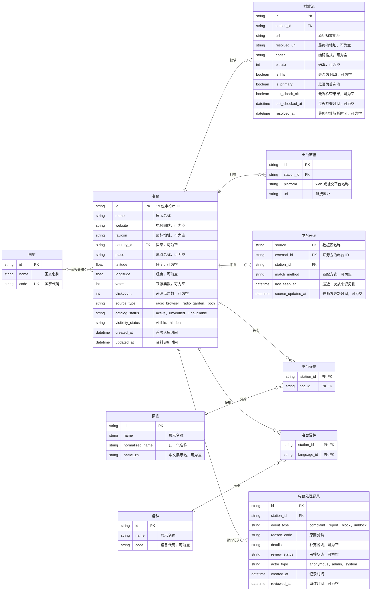

# V2 电台数据库设计

**文档状态：已完成（当前 V2 建表结构与两来源导入规则）。** 后续调整表结构或导入规则时，应同步更新本文和 [`schema.sql`](../schema.sql)。

本文记录 V2 电台数据结构及各字段的含义。目标是将电台、播放流、外部链接、数据来源和分类关系分开保存，并为投诉、举报及平台屏蔽保留处理记录。Radio Garden 的本地导入脚本位于 [`radio-garden/processing/import-v2.mjs`](../../radio-garden/processing/import-v2.mjs)，Radio Browser 的本地导入脚本位于 [`radio-browser/processing/import-v2.mjs`](../../radio-browser/processing/import-v2.mjs)；V2 API 尚未实现。

默认的本地 V2 数据库路径是 `worldTuner-data/v2/data/worldtuner-v2.sqlite`，目前已导入 Radio Garden 数据。`worldTuner-data/v2/worldtuner-v2.sqlite` 是另一个独立的空库，初始化及默认导入脚本不会自动更新它。Navicat 打开数据库时应核对文件路径并重新连接以刷新表结构与数据。

## 设计约定

- `station` 是唯一的电台主体；`id` 是 V2 新库的内部主键，可以重新分配，不维护旧电台 ID 映射。
- 所有生成的实体主键使用 19 位十进制 `TEXT` 字符串，关联外键也使用 `TEXT`；复合主键仍由其业务字段组成，不额外添加数字 ID。
- 电台最多关联一个国家，不维护国家以下的州、省等行政区划；地点名称和坐标直接保存在电台上。`place` 只用于地点文本搜索，不表示行政区划。
- 标签和语种均为多对多关系。原始逗号分隔文本不作为 V2 的关联依据。
- 播放地址单独保存；电台主表保留 `website` 字符串，其他网站及社交链接由关联表保存。一个电台可以有多个播放流、多个同平台链接。
- `station.source_type` 是便于查询的来源摘要；`station_source` 中的外部 ID 和来源关联是来源身份的依据。
- 没有用户体系。处理记录中的 `anonymous` 不对应用户表；`hidden` 表示平台对外屏蔽，而非个人拉黑。
- 下文的 `boolean` 和 `datetime` 是逻辑类型；若落地到 D1/SQLite，分别使用带约束的 `INTEGER` 和统一格式的 `TEXT`。

## ER 图

图的可编辑版本如下；目录中的 [ER 图图片](mermaid-diagram.png) 是讨论阶段保存的图片。

## 字符串主键规则

`country`、`station`、`station_stream`、`station_link`、`tag`、`language`、`moderation_record` 的 `id` 均为 19 位、左侧补零的十进制 `TEXT` 字符串。生成器位于 [`v2/src/snowflake-id.mjs`](../src/snowflake-id.mjs)：以 2024-01-01 UTC 为起点，使用 41 位毫秒时间、10 位 `workerId`、12 位同毫秒序列。数据库约束检查长度和数字字符，生成器负责产生值；`TEXT` 主键不能再依赖 SQLite 自增。

关联这些表的外键也统一为 `TEXT`。`station_source` 保持 `(source, external_id)` 联合主键，`station_tag`、`station_language` 保持两个字符串外键组成的联合主键。`external_id` 是来源方原值，不转换为雪花 ID。使用多个写入进程时必须为每个进程分配不同的 `workerId`；时钟回退时生成器会报错。JavaScript 和 JSON 中始终把 ID 当字符串，不转成 `Number`。这种 ID 便于生成和排序，不是防爬虫凭证。

## 电台主体

| 字段                       | 约束与含义                                                                                                                                    |
| -------------------------- | --------------------------------------------------------------------------------------------------------------------------------------------- |
| `id`                       | 19 位字符串主键；仅作为 V2 内部标识，不承诺与旧库 ID 相同。                                                                                   |
| `name`                     | 非空展示名称。来源缺少可信名称时，导入规则需确定占位名称和 `catalog_status`。                                                                 |
| `website`                  | 可空的网站 URL 字符串；Radio Garden 使用频道详情中的 `website`，Radio Browser 使用 `homepage`，不为同一值重复生成 `station_link`。            |
| `favicon`                  | 可空的图标 URL。                                                                                                                              |
| `country_id`               | 可空外键，直接指向 `country.id`。未知国家保留空值。                                                                                           |
| `place`                    | 可空的地点名称字符串，用于地点关键词搜索；不表示行政区划或城市边界。Radio Garden 可取频道关联地点的 `title`，Radio Browser 可取非空 `state`。 |
| `latitude`、`longitude`    | 可空坐标，必须同时存在或同时为空；范围分别为 -90～90、-180～180。                                                                             |
| `votes`、`clickcount`      | 可空的来源统计值；现阶段迁移 Radio Browser 原值，Radio Garden 缺失时为 `NULL`，不跨来源相加。                                                 |
| `source_type`              | 非空，当前取 `radio_browser`、`radio_garden`、`both`；应由 `station_source` 的关联集合计算并同步维护。                                        |
| `catalog_status`           | 非空，`active`、`unverified`、`unavailable`；描述电台资料或播放可用性。                                                                       |
| `visibility_status`        | 非空，默认 `visible`，另有 `hidden`；仅描述平台是否展示该电台。                                                                               |
| `created_at`、`updated_at` | 非空，记录 V2 入库和资料更新时间；不冒充来源方的创建或更新时间。                                                                              |

`catalog_status` 与 `visibility_status` 相互独立：电台可有可用的播放流，但因处理决定而被屏蔽。`station` 不再包含原始的 `homepage`、`state` 或 `iso_3166_2` 字段；Radio Browser 的 `state` 仅作为 `place` 的候选文本。

## 其他表的字段说明

### `country`：国家

| 字段   | 约束与含义                                                     |
| ------ | -------------------------------------------------------------- |
| `id`   | 内部主键，供 `station.country_id` 引用。                       |
| `name` | 非空国家或地区名称。                                           |
| `code` | 唯一、非空的两位大写国家或地区代码；没有可靠代码时不创建记录。 |

### `station_stream`：播放流

| 字段              | 约束与含义                                                             |
| ----------------- | ---------------------------------------------------------------------- |
| `id`              | 内部主键。                                                             |
| `station_id`      | 非空电台外键；删除电台时级联删除播放流。                               |
| `url`             | 非空的原始播放入口地址。                                               |
| `resolved_url`    | 可空的重定向后最终流地址。                                             |
| `codec`           | 可空的音频编码格式。                                                   |
| `bitrate`         | 可空的非负码率。                                                       |
| `is_hls`          | 可空布尔值；`NULL` 表示来源未提供或尚未判断。                          |
| `is_primary`      | 非空布尔值，默认 `0`；同一电台最多一条首选流。                         |
| `last_check_ok`   | 可空布尔值，表示最近一次播放检查结果；解析到重定向地址不等于检查成功。 |
| `last_checked_at` | 可空的最近检查时间。                                                   |
| `resolved_at`     | 可空的最终流地址解析时间。                                             |

### `station_link`：网站与社交链接

| 字段         | 约束与含义                                                 |
| ------------ | ---------------------------------------------------------- |
| `id`         | 内部主键。                                                 |
| `station_id` | 非空电台外键；删除电台时级联删除链接。                     |
| `platform`   | 非空平台名称；普通网站使用 `web`，社交链接使用来源平台名。 |
| `url`        | 非空链接字符串；`(station_id, platform, url)` 唯一。       |

### `station_source`：来源身份

| 字段                | 约束与含义                                                     |
| ------------------- | -------------------------------------------------------------- |
| `source`            | `radio_browser` 或 `radio_garden`，与 `external_id` 组成主键。 |
| `external_id`       | 来源方的非空电台 ID。                                          |
| `station_id`        | 非空 V2 电台外键；删除电台时级联删除来源关联。                 |
| `match_method`      | 可空的跨来源匹配方法；仅有一个来源时不推断。                   |
| `last_seen_at`      | 最近一次从该来源取得此记录的时间。                             |
| `source_updated_at` | 可空的来源方资料更新时间，不能用本地采集时间冒充。             |

### `tag`、`language` 与关联表

| 表与字段                                                      | 约束与含义                                                                                               |
| ------------------------------------------------------------- | -------------------------------------------------------------------------------------------------------- |
| `tag.id`、`tag.name`、`tag.normalized_name`                   | 标签内部主键、非空展示名称和非空归一化名称；归一化名称有查询索引。                                       |
| `tag.name_zh`                                                 | 可空中文展示名；已有标准译名写入此列，含义未确定的标签保持 `NULL`，不覆盖英文匹配键。                    |
| `language.id`、`language.name`、`language.code`               | 语种内部主键、非空展示名称和可空语言代码；Radio Browser 导入时优先用规范化代码查找语种，代码有查询索引。 |
| `station_tag.station_id`、`station_tag.tag_id`                | 电台与标签的多对多关系；两个外键组成联合主键，删除任一端时级联删除关系。                                 |
| `station_language.station_id`、`station_language.language_id` | 电台与语种的多对多关系；两个外键组成联合主键，删除任一端时级联删除关系。                                 |

### `moderation_record`：投诉、举报及屏蔽记录

| 字段            | 约束与含义                                                                   |
| --------------- | ---------------------------------------------------------------------------- |
| `id`            | 内部主键。                                                                   |
| `station_id`    | 非空电台外键；有处理记录时不能直接删除电台。                                 |
| `event_type`    | `complaint`、`report`、`block`、`unblock`。                                  |
| `reason_code`   | 非空的原因分类。                                                             |
| `details`       | 可空的补充说明。                                                             |
| `review_status` | 投诉、举报必填 `pending`、`accepted` 或 `rejected`；屏蔽、解除屏蔽必须为空。 |
| `actor_type`    | 非空的 `anonymous`、`admin` 或 `system`，不对应用户表。                      |
| `created_at`    | 非空的记录时间。                                                             |
| `reviewed_at`   | 可空的审核时间。                                                             |

## 播放流、链接与来源

### `station_stream`：播放地址及检查状态

`url` 保存原始播放入口，`resolved_url` 保存最终解析地址；`codec`、`bitrate`、`is_hls` 和检查结果均归属于具体播放流。来源未提供 HLS 信息时 `is_hls` 为 `NULL`，不能推断为否。每个电台可有零到多个播放流，但同一时刻最多一个 `is_primary = true` 的流。没有可用流时如何选定首选流，需在导入与播放规则中统一定义。

### `station_link`：其他网站及社交链接

`platform = 'web'` 表示电台主表 `website` 以外的其他网站链接；社交平台直接保存来源提供的平台名，不设置仅允许当前已知平台的白名单。同一电台允许多个 `web` 或相同社交平台的链接，以 `(station_id, platform, url)` 去重。

| 来源字段                         | V2 字段                                                  |
| -------------------------------- | -------------------------------------------------------- |
| Radio Browser `homepage`         | `station.website`，保留字符串，不重复写入 `station_link` |
| Radio Garden `website`           | `station.website`，保留字符串，不重复写入 `station_link` |
| Radio Garden `social[]` 中每一项 | `station_link(platform=social.platform, url=social.url)` |

### `station_source`：来源身份

以 `(source, external_id)` 为联合主键，一个来源记录只指向一个 V2 电台。Radio Browser 的 `stationuuid`、Radio Garden 的频道 ID 分别作为对应来源的 `external_id`，不互相伪装成同一种 ID。`match_method` 记录跨源匹配方法，`last_seen_at` 记录本地最近一次见到该来源记录的时间。来源方有可靠更新时间时才写 `source_updated_at`。

## 标签、语种与国家

- `station_tag` 和 `station_language` 分别以两个外键组成联合主键，避免同一电台重复关联同一分类。
- `tag.normalized_name` 用于归一化和去重；同义词是否合并到同一个标签，需要单独制定清洗规则，不仅靠大小写匹配。
- `language.code` 可空；有可靠代码时以规范化代码匹配语种，不能只凭名称或逗号分隔位置推断代码。没有可靠代码的来源文本留待核查。
- `country.code` 是唯一的国家代码；没有可靠代码的电台允许 `country_id = NULL`，不凭自由文本猜测关联。
- 分类电台数可由关联关系统计，暂不作为这四个核心实体的基础字段。

### 标签清洗与回滚

[`clean-tags.mjs`](../../radio-browser/processing/clean-tags.mjs) 默认只预览，显式 `--apply` 会先备份 `tag`、`station_tag` 及规则和映射，再在同一事务中重建两张表的数据。明确的语言、频率、码率、表情等噪声移除；同义词和纯格式差异合并；含义待审的标签仍保留。优先沿用标准标签原 ID，所有关联按旧 ID 到新 ID 的映射重建并去重，不修改电台主体。支持 `--restore` 恢复备份，恢复前也会保存当前标签快照。

2026-09-30 已执行首轮清洗：标签 12,356 → 11,982，关联 152,264 → 136,430；11,893 个非标准标签仍待审。89 个标准标签的中文名已写入 `tag.name_zh`，同时保存在规则 JSON 和中英对照表中；中文列升级没有更改 ID 和关联。执行记录见[清洗执行结果](标签清洗报告/清洗执行结果.json)及[中文写入结果](标签清洗报告/中文写入结果.json)，逐项去向见[清洗映射](标签清洗报告/清洗去向.json)。现有 D1 库需另行执行 `worldTuner-api/migrations/0003_tag_name_zh.sql` 后才能导入含中文列的数据。

## 投诉、举报与屏蔽

`moderation_record` 保存 `complaint`、`report`、`block`、`unblock` 事件。投诉和举报可带 `review_status`，初始为 `pending`；处理后可记为 `accepted` 或 `rejected`。`block`、`unblock` 是平台操作，不要求有审核状态。`actor_type` 仅区分匿名提交、管理操作或系统操作，没有 `user_id`。

收到投诉或举报只新增记录，不自动屏蔽。决定屏蔽时新增 `block` 记录，并在同一事务中将 `station.visibility_status` 改为 `hidden`；恢复时新增 `unblock` 记录并改回 `visible`。记录保留处理历史，电台字段保存当前展示状态。

## Radio Garden 本地导入

在 `worldTuner-data/` 目录下，先用 `npm run init:v2` 创建空库，再用 `npm run process:radio-garden:v2` 导入。导入脚本读取 `radio-garden/data/radio-garden.sqlite`，在单个事务中写入默认 V2 库；采集库以只读方式打开。目标库已有 Radio Garden 来源记录时拒绝重复导入。可用 `--source`、`--target` 指定其他本地路径。具体用法见[数据处理说明](../../radio-garden/processing/README.md)。

| 来源数据                             | V2 处理规则                                                                                                                                            |
| ------------------------------------ | ------------------------------------------------------------------------------------------------------------------------------------------------------ |
| `channel_details.data.id`、`title`   | 分别写入 `station_source.external_id`、`station.name`；内部 `station.id` 重新分配。                                                                    |
| `channel_details.data.website`       | 原样作为字符串写入 `station.website`，缺失时为 `NULL`。                                                                                                |
| `channel_details.data.place.title`   | 写入 `station.place`，作为地点搜索文本；同一频道的其他 `place_channels` 关系仍保留在采集库。                                                           |
| `channel_details.data.place.id`      | 关联 `radio_garden_places.id`，取得电台经纬度；缺失地点会使整批回滚。                                                                                  |
| `channel_details.data.country.title` | 通过 `radio_garden_country_names.region_code` 取得两位代码后关联 `country`；无法确认代码时 `country_id = NULL`。                                       |
| `stream_redirect.redirect_url`       | Radio Garden listen 接口作为 `station_stream.url`，重定向结果作为 `resolved_url`，采集时间作为 `resolved_at`。不据此设置 `last_check_ok` 或 `is_hls`。 |
| `channel_details.data.social[]`      | 每项写入 `station_link(platform, url)`，同一电台的平台与 URL 组合去重。                                                                                |
| 来源未提供的字段                     | `favicon`、`votes`、`clickcount`、标签、语种和播放检查结果不推断；`catalog_status` 默认 `unverified`，`visibility_status` 默认 `visible`。             |

截至 2026-09-30，默认 V2 库已按新字符串 ID 规则导入 34,243 条 Radio Garden 电台、34,243 条播放流和 52,018 条链接，完整性与外键检查通过。`v2/worldtuner-v2.sqlite` 仍为空库。采集库中另有 92 个已发现频道缺少详情；`zNVxkuZ9` 的详情响应实际为 `page`，导入时跳过。27 条电台因来源国家名称暂无可靠两位代码而暂不关联 `country`：Afghanistan 1 条、Azores 12 条、Madeira 9 条、Tahiti 5 条。重新采集后的数量可能变化。

## Radio Browser 导入与去重规则

Radio Browser 的 `homepage` 直接写入 `station.website`，不再为同一地址创建 `station_link(platform='web')`。`stationuuid` 写入 `station_source.external_id`；`countrycode` 优先用于关联国家，非空 `state` 作为 `station.place` 的搜索文本。`url`、`url_resolved` 及编码、码率、HLS、检查结果写入 `station_stream`，票数与点击数写入电台。无效或缺失的名称、地址和坐标应单独统计，不用错误数据填充必填字段。

语种以 `languagecodes` 为匹配依据：拆分、去空白、统一为小写后按代码精确匹配，非空代码有唯一索引。`language.name` 是展示名称，不作为主匹配键；名称与代码数量不一致时，不按数组位置配对。暂未建立两位与三位代码的别名表，因此 `en` 与 `eng` 仍是不同代码；无代码的名称留在原始库。格式不符合语言代码规则的值不导入关联表。

去重键是实际播放地址：先取非空 `url_resolved`，否则取 `url`，只去掉首尾空白，不改写协议、主机大小写、尾斜杠或查询参数。Radio Browser 内部同键的记录合为一台，所有 `stationuuid` 分别保存在 `station_source`。与已有 Radio Garden `station_stream` 的同键记录也合并；若多个 Garden 电台命中同一键，归并其来源、播放流、链接、标签、语种和审核记录。来源冲突时采用 Radio Browser 的非空电台字段，Radio Browser 空值保留 Garden 值；同来源冲突时优先最近检查可用、票数高、点击数高的记录，再按 UUID 稳定排序。`visibility_status` 不由来源数据覆盖。合并时 `source_type` 更新为 `both`，并在 `match_method` 记录 `playback_url`。

本地源库有 66,251 条电台。导入脚本对无播放地址、同组均无名称的记录单独计数并跳过；合法但未见过的国家代码建立国家记录，坐标仅在成对且范围有效时使用。播放地址相同是本项目当前定义的去重条件，地址相近或官网相同不会自动合并。导入只写本地 V2 文件，已有 Radio Browser 来源时拒绝重复导入；原始库只读，整批写入使用事务。

截至 2026-09-30，默认本地 V2 库已导入 66,248 条 Radio Browser 来源记录：同源归并 12,051 条，6,530 个播放地址命中 Radio Garden，另归并 6 条被这些地址命中的 Garden 电台，新增 47,667 条电台。目标库现有 81,904 条电台，其中 `both` 6,530 条。原始库有 1 条无播放地址、2 条所属地址组没有有效名称，未导入。完整性和外键检查通过，有 Radio Browser 来源的电台不存在跨电台重复播放地址；另外 13 组仅含 Radio Garden 来源的旧重复地址未由本次 Browser 导入触及。

## 在 Navicat 中查看字段说明

本文是字段含义的维护位置。SQLite 没有可由 Navicat 字段备注栏读取的独立列注释属性；建表语句内部的 SQL 注释可以保留在 DDL 文本中，但仅修改 `schema.sql` 不会更新已经创建的数据库。不要为了显示备注而直接修改 SQLite 的 `sqlite_schema` 或覆盖已导入的表。

## 迁移边界与待定规则

1. 从现有 Radio Browser、Radio Garden 数据生成 V2 新库，先在本地验证，再单独规划 D1 导入；日常检查不修改生产库。
2. 可以重新分配 `station.id`，不创建旧 ID 映射表，也不以旧收藏或旧链接兼容为迁移约束。
3. 旧 `station.tags`、`station.language` 等自由文本需要拆分和清洗后进入关联表；不完整或有冲突的值保留在源数据中供核查，不强行建立错误关联。
4. Radio Browser 的非空 `state` 可以作为 `station.place` 的来源；`iso_3166_2` 不进入 V2 目标结构。Radio Garden 导入时以频道详情的 `place.title` 为单值，其他地点关系仍留在采集库；国家直接关联电台。
5. 屏蔽电台在列表、搜索、地图和详情接口中的具体返回行为，以及 `catalog_status` 的更新触发条件，实施 API 前需统一确定。
6. 后续若开放匿名投诉或举报写入 API，需要单独设计输入校验、限流和滥用防护；当前 ER 图只定义存储结构。

### 第二轮标签处理（2026-09-30）

第二轮已备份并写回本地 V2 数据库：标签 11,982 → 11,222，电台标签关联 136,430 → 119,017；删除明确噪声 308 项，归并重复标签 452 项，419 个标准分类的中文名实际保存在 `tag.name_zh` 中。音乐风格、节目类型、年代和多语言别名继续共用 Radio Browser 导入规则。

剩余 10,803 个标签保留原始语义，包含品牌、人名及未建立规则的描述；“待审”是后续处理队列，不表示必须逐个人工操作，也不表示无效。未知标签仍有关联，客户端应以 `name_zh ?? name` 显示。

详见[第二轮结果与备份路径](标签清洗报告/第二轮执行结果.json)、[全部旧标签去向](标签清洗报告/第二轮清洗去向.json)、[校验结果](标签清洗报告/第二轮校验结果.json)及[剩余处理队列](标签清洗报告/剩余未分类标签.json)。119,017 条关联已与备份映射独立逐项核对；外键、完整性检查通过，其他业务表行数未变，相关 8 项测试通过。本轮仅修改本地数据库。

### AI 全量结果入库（2026-09-30）

已将 GPT-5.5 子线程产出的 10,803 条处理结果导入本地 V2：删除噪声 1,669 项、合并 783 项、拆分 94 项、保留 8,257 项。连续映射先展开为最终目标，再重建电台关联。

当前标签 **8,656** 个，电台标签关联 **107,768** 条，中文非空 **1,358** 个。剩余 **7,298** 个没有确定中文，保留原名及有效关联。子线程报告中的中文覆盖是结果项计数，不能当成入库后唯一标签数；本节采用数据库实际去重统计。

新增处理脚本为 `worldTuner-data/radio-browser/processing/apply-ai-tags.mjs`。写回前备份，之后按最终映射独立核对全部 107,768 条关联，原有 419 个标准标签逐行保持，其他表行数不变，外键、数据库完整性及相关 10 项测试通过。

详见[入库结果与备份路径](标签清洗报告/AI处理包/入库结果.json)、[入库逐项映射](标签清洗报告/AI处理包/入库关联映射.json)、[校验结论](标签清洗报告/AI处理包/入库校验.json)及[入库后全部标签](标签清洗报告/AI处理包/入库后全部标签.json)。本轮操作范围是本地 `v2/data/worldtuner-v2.sqlite`。
